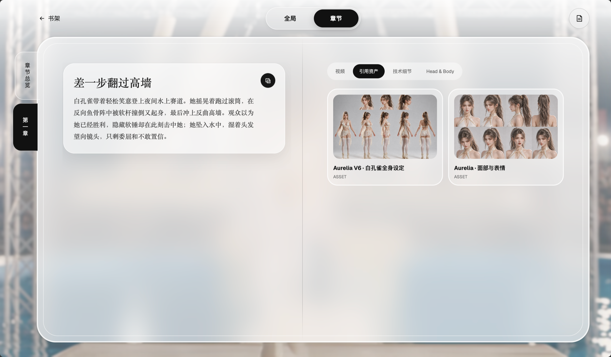
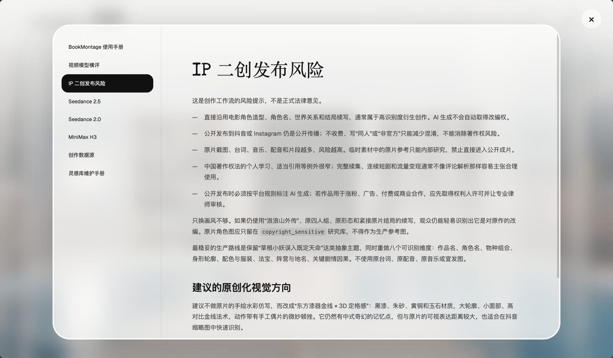

# BookMontage · 书间

一个本地优先、Harness-first 的长篇 AI 视频创作工作台。

人负责想象、写草稿和审核；Codex、Claude Code 等 Harness 负责维护角色与世界资产、整理章节、编译模型提示词并操作生成流程。前端只做一件事：让人舒适地阅读和判断。


<p align="center">
  
  
</p>

## 核心设计

- 一本书是最高层级；全局角色、地点、阵营和道具只保存一次，段落只引用。
- 人类草稿、可读叙事、模型指令和生成视频彼此分层。
- SQLite 是唯一事实源；`.bookmontage/` 包含全部私人数据与素材，源码仓库不含故事数据或密钥。
- 所有身份使用一个 36 位版本化 ID；上游资产换版后，下游引用会产生警告。
- 灵感库保存跨书籍视觉参考，并为 Harness 提供可检索的反向提示词式详细描述。

数据库只有两张表：`item(id, type, parent, data)` 与 `link(source, target, kind)`。

## 本地运行

需要 Node.js 22.13+。

```bash
npm install
npm run bookmontage -- init
npm run bookmontage -- export
npm run dev
```

常用命令：

```bash
npm run bookmontage -- list
npm run bookmontage -- show <id|slug|path>
npm run bookmontage -- inspiration-search "云海 巨物奇观" --type 场景 --full
npm run bookmontage -- prompt-search "仙侠 打斗" --model 2.5 --limit 3 --full
npm run bookmontage -- verify
```

Harness 的入口是 [`skills/bookmontage/SKILL.md`](skills/bookmontage/SKILL.md)。模型技巧、提示词案例、版权提醒和灵感库规范会由它按任务按需读取。

## 数据与版权

公开源码与私人数据分仓保存。恢复项目时，将私人数据仓库克隆为 `.bookmontage/`，再执行 `npm run bookmontage -- export`。

代码使用 MIT License。示例媒体、研究截图和第三方参考图不因进入工作台而改变其原有权利状态；生产与公开发布前仍需确认授权。
